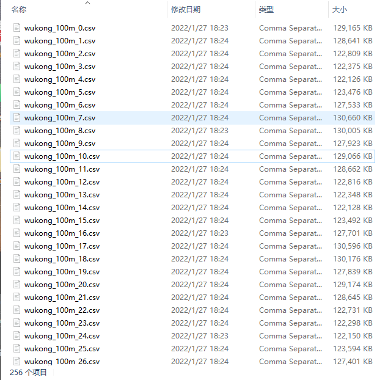
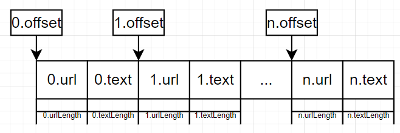

# 概述
对于一亿条数据的存储方式，由于需要根据分词结果建立倒排索引，故首先需要解决的是对每个文档进行编号处理。最终实现根据编号对文档实现随机访问。

本次搜索引擎文档集选用的是悟空数据集，具有一亿条数据量

https://wukong-dataset.github.io/wukong-dataset/download.html

下载后解压如下图所示，有256个文件，每个文件大约300~400w左右条记录，总计有一亿条数据



csv文件由两列组成，第一列为url，第二列为文字描述

由于csv文件缺少索引结构，所以无法实现根据行号随机访问
故我们需要对文件进行格式转换建立索引文件，对于任意一个文件，
我们可以记录以下数据，
+ 某一条数据起始的偏移量`offset`
+ url列的字节长度`urlLength`
+ 文字描述列的字节长度`textLength`

考虑到csv文件为了其可读性与结构性，其具有其特定的格式规则，而我们需要建立外部索引文件实现对原csv文件的随机访问，故需要将csv文件中的结构化信息去除。

最终设计出文件的存储结构为如下紧凑结构，中间部分即为dat数据文件的存储结构，周围的offset和length为索引文件的存储结构


给定一个id读取时，首先查找其索引文件，得到其offset与length信息，再

+ 对某个文件读取第`[offset, offset+urlLength)`的字节便为该记录的url
+ 对某个文件读取第`[offset+urlLength, offset+urlLength+textLength)`的字节便为该记录的文本

索引文件可使用如下结构体进行存储
```go
type SeekInfo struct {
	Offset     uint32
	UrlLength  uint16
	TextLength uint16
}

type ContentInfo struct {
	ItemLength uint32
	SeekInfo   []SeekInfo
}
```

在代码[](../tools/fileIndex/convert/main.go)中编写了256个csv文件并行地批量转换地过程。

在代码[](../tools/fileIndex/reader/main.go)中编写了第0号文件的随机读取的基本逻辑。